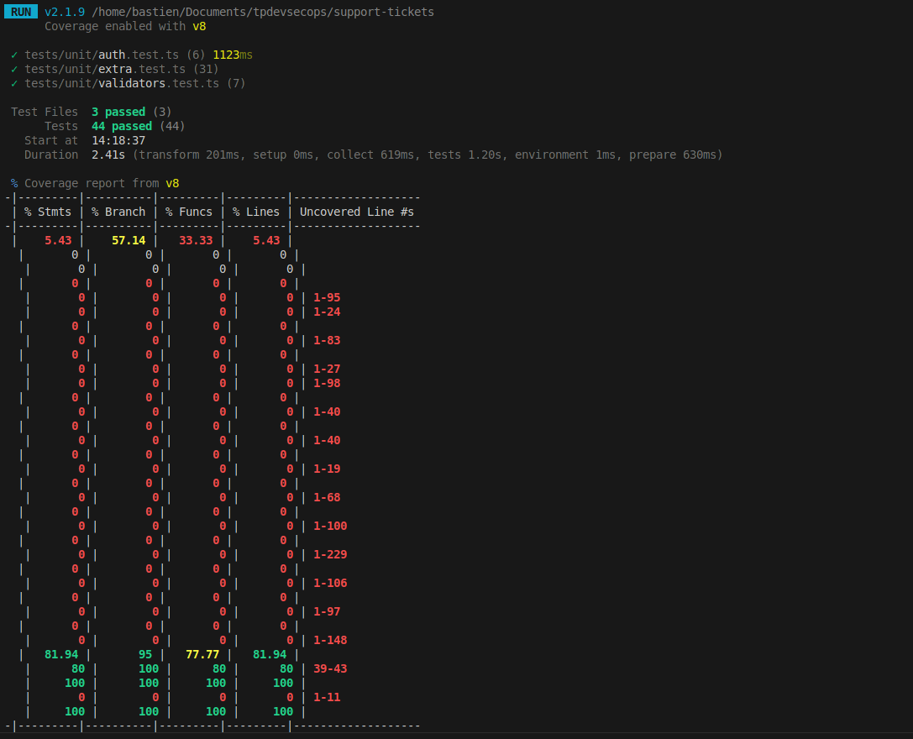
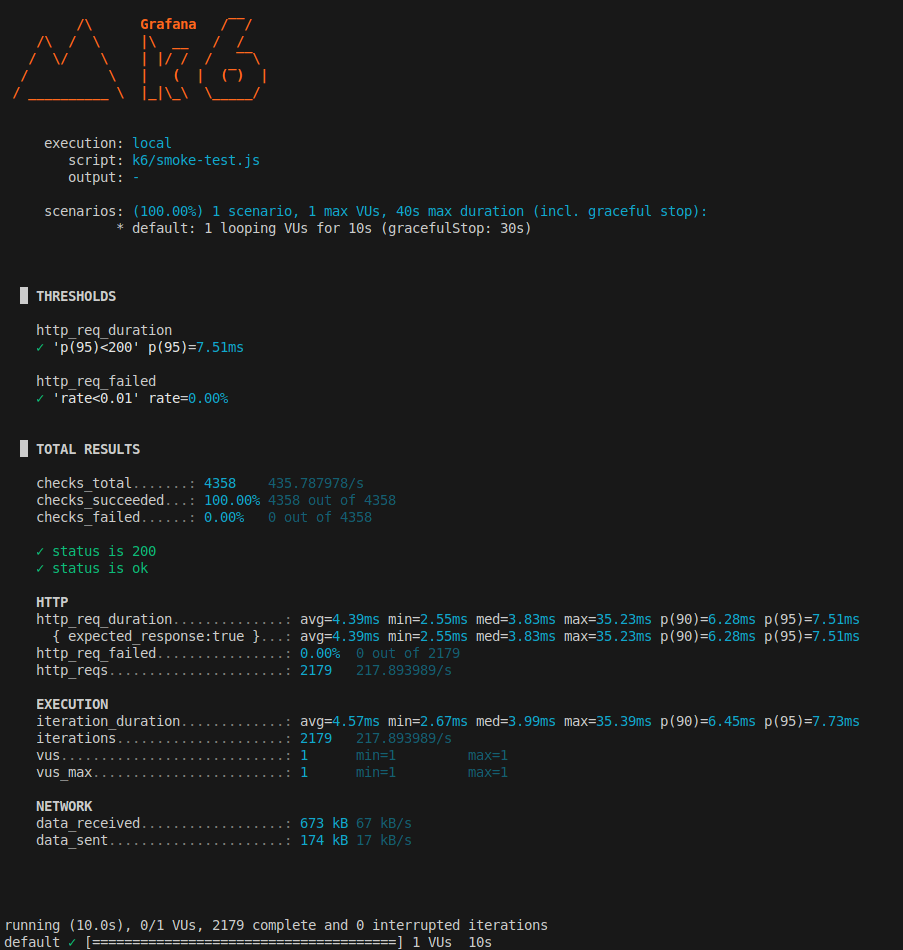
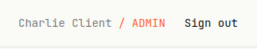
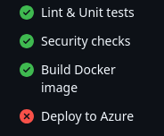
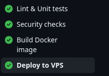
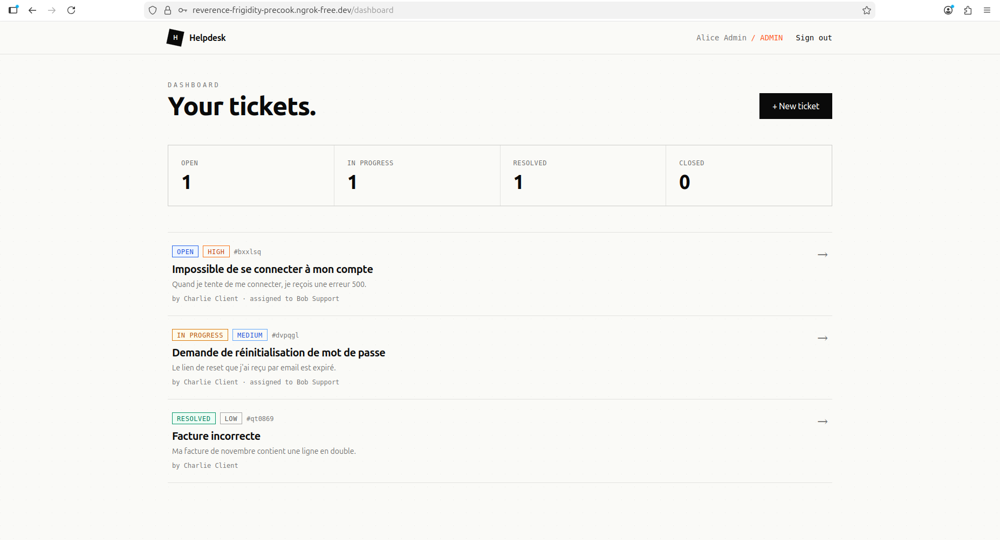

1. Pourquoi utilise-t-on un multi-stage build plutôt qu’un seul FROM ?

Le multi-stage build permet de séparer les différentes étapes de construction d’une application Docker afin d’obtenir une image finale plus propre et plus légère. Dans ce Dockerfile, un premier stage (deps) installe les dépendances, un second (builder) compile l’application Next.js et génère le client Prisma, puis un dernier stage (runner) contient uniquement les fichiers nécessaires à l’exécution en production. Cette approche évite d’embarquer les outils de build, les dépendances de développement ou les fichiers inutiles dans l’image finale. On réduit ainsi la taille de l’image, on améliore la sécurité et on accélère les déploiements.

2. Que fait la ligne output: 'standalone' dans next.config.js et comment Docker l’exploite-t-elle ?

La configuration output: 'standalone' dans Next.js demande au framework de générer une version autonome de l’application dans le dossier .next/standalone. Cette version contient un serveur Node.js minimal (server.js) ainsi que uniquement les dépendances nécessaires au fonctionnement de l’application en production. Docker exploite cela en copiant directement ce dossier dans l’image finale grâce à la ligne COPY --from=builder /app/.next/standalone ./. Cela évite de copier l’ensemble du projet et tous les node_modules, ce qui permet de créer une image plus légère, plus rapide à démarrer et mieux optimisée pour la production.

3. Pourquoi crée-t-on un utilisateur nextjs non-root ?

Créer un utilisateur non-root permet d’améliorer la sécurité du conteneur. Par défaut, les processus Docker s’exécutent avec les privilèges root, ce qui peut être dangereux si l’application est compromise. En utilisant un utilisateur dédié comme nextjs, on limite les permissions du processus Node.js et donc les risques de modification du système ou d’accès non autorisé à certaines ressources. Cette pratique est aujourd’hui recommandée dans les environnements de production et les architectures cloud-native, notamment avec Kubernetes ou les politiques de sécurité Docker. Le dossier /app/data est également créé avec les bons droits afin que l’utilisateur nextjs puisse écrire la base SQLite sans problème.

4. À quoi sert HEALTHCHECK dans le Dockerfile ?

La directive HEALTHCHECK permet à Docker de vérifier automatiquement si l’application fonctionne correctement après son démarrage. Dans ce cas, Docker envoie régulièrement (toute les 30 secondes) une requête HTTP vers l’endpoint /api/health. Si cette route répond correctement, le conteneur est considéré comme healthy. En revanche, si plusieurs vérifications échouent (3 echec), le conteneur passe en état unhealthy. Cela est très utile en production car les orchestrateurs comme Kubernetes ou Docker Swarm peuvent alors redémarrer automatiquement le service ou retirer l’instance du load balancer. Le HEALTHCHECK améliore donc la supervision, la disponibilité et la résilience de l’application.

## 1.2 Builder et lancer le conteneur

Apres build, taille de l'image est est de 338MB, c'est trop bien
curl http://localhost:3000/api/health
{"status":"ok","timestamp":"2026-05-22T10:32:24.171Z","uptime":407.309058665}
connection admin réussi !
docker compose up réussi !

helpdesk-app | ▲ Next.js 14.2.33
helpdesk-app | - Local: http://localhost:3000
helpdesk-app | - Network: http://0.0.0.0:3000
helpdesk-app |
helpdesk-app | ✓ Starting...
helpdesk-app | ✓ Ready in 93ms

# Etape 2 - testsunitaires

## 2.1 lancer les test fournis

npm test
npm run test:coverage # ouvre coverage/index.html

> support-tickets@0.1.0 test
> vitest run

The CJS build of Vite's Node API is deprecated. See https://vite.dev/guide/troubleshooting.html#vite-cjs-node-api-deprecated for more details.

RUN v2.1.9 /home/bastien/Documents/tpdevsecops/support-tickets

✓ tests/unit/auth.test.ts (6) 585ms
✓ tests/unit/validators.test.ts (7)

Test Files 2 passed (2)
Tests 13 passed (13)
Start at 12:35:40
Duration 1.43s (transform 114ms, setup 0ms, collect 205ms, tests 594ms, environment 0ms, prepare 248ms)

> support-tickets@0.1.0 test:coverage
> vitest run --coverage

The CJS build of Vite's Node API is deprecated. See https://vite.dev/guide/troubleshooting.html#vite-cjs-node-api-deprecated for more details.

RUN v2.1.9 /home/bastien/Documents/tpdevsecops/support-tickets
Coverage enabled with v8

✓ tests/unit/auth.test.ts (6) 1006ms
✓ tests/unit/validators.test.ts (7)

Test Files 2 passed (2)
Tests 13 passed (13)
Start at 12:35:42
Duration 2.32s (transform 185ms, setup 0ms, collect 331ms, tests 1.02s, environment 1ms, prepare 376ms)

% Coverage report from v8
--------|---------|----------|---------|---------|-------------------
File | % Stmts | % Branch | % Funcs | % Lines | Uncovered Line #s
--------|---------|----------|---------|---------|-------------------
...iles | 4.28 | 28.57 | 23.8 | 4.28 |  
 ...ets | 0 | 0 | 0 | 0 |  
 ...ts | 0 | 0 | 0 | 0 |  
 .../k6 | 0 | 0 | 0 | 0 |  
 ...js | 0 | 0 | 0 | 0 | 1-95  
 ...js | 0 | 0 | 0 | 0 | 1-24  
 ...sma | 0 | 0 | 0 | 0 |  
 ...ts | 0 | 0 | 0 | 0 | 1-83  
 ...app | 0 | 0 | 0 | 0 |  
 ...sx | 0 | 0 | 0 | 0 | 1-27  
 ...sx | 0 | 0 | 0 | 0 | 1-98  
 ...gin | 0 | 0 | 0 | 0 |  
 ...ts | 0 | 0 | 0 | 0 | 1-40  
 ...ter | 0 | 0 | 0 | 0 |  
 ...ts | 0 | 0 | 0 | 0 | 1-40  
 ...lth | 0 | 0 | 0 | 0 |  
 ...ts | 0 | 0 | 0 | 0 | 1-19  
 ...ets | 0 | 0 | 0 | 0 |  
 ...ts | 0 | 0 | 0 | 0 | 1-68  
 ...id] | 0 | 0 | 0 | 0 |  
 ...ts | 0 | 0 | 0 | 0 | 1-100  
 ...ard | 0 | 0 | 0 | 0 |  
 ...sx | 0 | 0 | 0 | 0 | 1-229  
 ...gin | 0 | 0 | 0 | 0 |  
 ...sx | 0 | 0 | 0 | 0 | 1-106  
 ...ter | 0 | 0 | 0 | 0 |  
 ...sx | 0 | 0 | 0 | 0 | 1-97  
 ...id] | 0 | 0 | 0 | 0 |  
 ...sx | 0 | 0 | 0 | 0 | 1-148  
 ...lib | 77.96 | 83.33 | 66.66 | 77.96 |  
 ...ts | 80 | 100 | 80 | 80 | 39-43  
 ...ts | 0 | 0 | 0 | 0 | 1-11  
 ...ts | 100 | 100 | 100 | 100 |  
--------|---------|----------|---------|---------|-------------------

## 2.2 ajouter vos propres tests

tests ajouté dans extra.test.ts
nouveau test :


## 2.3 question

Pourquoi la couverture globale est si basse (5.43 %)
Le rapport v8 inclut tous les fichiers du projet dans le calcul, pas seulement src/lib/. Or la grande majorité des fichiers affiche 0 % — ce sont les fichiers non exécutés lors des tests :

Composants React (src/app/dashboard/page.tsx, src/app/login/page.tsx, etc.) — ils nécessitent un environnement DOM et React Testing Library, qui sortent du cadre des tests unitaires Vitest purs.
Routes API Next.js (src/app/api/tickets/route.ts, etc.) — elles dépendent de Prisma (base de données) et de NextRequest/NextResponse, ce qui demande soit un serveur réel, soit des mocks lourds.
prisma/seed.ts — script d'initialisation de BDD, pas de logique métier à tester unitairement.
Fichiers k6 (k6/load-test.js, etc.) — scripts de test de charge, pas du code applicatif.

Pourquoi src/lib/ n'est pas à 100 %

auth.ts — lignes 39–43 non couvertes : il s'agit de la fonction getAuthFromRequest(req: NextRequest). Elle dépend de NextRequest (objet HTTP de Next.js), difficile à instancier dans un test unitaire sans le framework complet.
prisma.ts — 0 % : instancie un PrismaClient qui se connecte à une vraie base de données SQLite. Ce fichier est délibérément exclu des tests unitaires — le tester nécessiterait une DB de test ou un mock de Prisma.
Branches à 95 % : le dernier 5 % correspond aux chemins d'erreur implicites gérés par Zod (cas extrêmes de validation non testés, comme des types inattendus passés aux schémas).

# etape 3 - tests de montée en charge avec k6

## 3.1 smoke test

k6 run k6/smoke-test.js

         /\      Grafana   /‾‾/
    /\  /  \     |\  __   /  /

/ \/ \ | |/ / / ‾‾\
/ \ | ( | (‾) |
/ ****\_\_**** \ |\_|\_\ \_\_\_\_\_/

     execution: local
        script: k6/smoke-test.js
        output: -

     scenarios: (100.00%) 1 scenario, 1 max VUs, 40s max duration (incl. graceful stop):
              * default: 1 looping VUs for 10s (gracefulStop: 30s)

█ THRESHOLDS

    http_req_duration
    ✓ 'p(95)<200' p(95)=7.51ms

    http_req_failed
    ✓ 'rate<0.01' rate=0.00%

█ TOTAL RESULTS

    checks_total.......: 4358    435.787978/s
    checks_succeeded...: 100.00% 4358 out of 4358
    checks_failed......: 0.00%   0 out of 4358

    ✓ status is 200
    ✓ status is ok

    HTTP
    http_req_duration..............: avg=4.39ms min=2.55ms med=3.83ms max=35.23ms p(90)=6.28ms p(95)=7.51ms
      { expected_response:true }...: avg=4.39ms min=2.55ms med=3.83ms max=35.23ms p(90)=6.28ms p(95)=7.51ms
    http_req_failed................: 0.00%  0 out of 2179
    http_reqs......................: 2179   217.893989/s

    EXECUTION
    iteration_duration.............: avg=4.57ms min=2.67ms med=3.99ms max=35.39ms p(90)=6.45ms p(95)=7.73ms
    iterations.....................: 2179   217.893989/s
    vus............................: 1      min=1         max=1
    vus_max........................: 1      min=1         max=1

    NETWORK
    data_received..................: 673 kB 67 kB/s
    data_sent......................: 174 kB 17 kB/s



running (10.0s), 0/1 VUs, 2179 complete and 0 interrupted iterations
default ✓ [======================================] 1 VUs 10s

## 3.2 Test de charge

========================================
k6 LOAD TEST — HELPDESK
========================================
Requests: 1903
Failed: 0.00%
p(95) latency: 10847 ms
avg latency: 4375 ms
Iterations: 634
========================================

running (4m01.4s), 00/50 VUs, 634 complete and 0 interrupted iterations
default ✓ [======================================] 00/50 VUs 4m0s

VOIR k6-summary-50VUs.json

## 3.3 test de charge 400 VUs

========================================
k6 LOAD TEST — HELPDESK
========================================
Requests: 1625
Failed: 16.74%
p(95) latency: 60001 ms
avg latency: 22589 ms
Iterations: 484
========================================

running (4m30.0s), 000/400 VUs, 484 complete and 287 interrupted iterations
default ✓ [======================================] 000/400 VUs 4m0s

VOIR k6-summary-400VUs.json

# etape 4 - securité
# 4.1

npm audit
# npm audit report

esbuild  <=0.24.2
Severity: moderate
esbuild enables any website to send any requests to the development server and read the response - https://github.com/advisories/GHSA-67mh-4wv8-2f99
fix available via `npm audit fix --force`
Will install vitest@4.1.7, which is a breaking change
node_modules/vite/node_modules/esbuild
  vite  <=6.4.1
  Depends on vulnerable versions of esbuild
  node_modules/vite
    @vitest/mocker  <=3.0.0-beta.4
    Depends on vulnerable versions of vite
    node_modules/@vitest/mocker
      vitest  0.0.1 - 0.0.12 || 0.0.29 - 0.0.122 || 0.3.3 - 3.0.0-beta.4
      Depends on vulnerable versions of @vitest/mocker
      Depends on vulnerable versions of vite
      Depends on vulnerable versions of vite-node
      node_modules/vitest
        @vitest/coverage-v8  <=2.2.0-beta.2
        Depends on vulnerable versions of vitest
        node_modules/@vitest/coverage-v8
    vite-node  <=2.2.0-beta.2
    Depends on vulnerable versions of vite
    node_modules/vite-node

glob  10.2.0 - 10.4.5
Severity: high
glob CLI: Command injection via -c/--cmd executes matches with shell:true - https://github.com/advisories/GHSA-5j98-mcp5-4vw2
fix available via `npm audit fix --force`
Will install eslint-config-next@16.2.6, which is a breaking change
node_modules/glob
  @next/eslint-plugin-next  14.0.5-canary.0 - 15.0.0-rc.1
  Depends on vulnerable versions of glob
  node_modules/@next/eslint-plugin-next
    eslint-config-next  14.0.5-canary.0 - 15.0.0-rc.1
    Depends on vulnerable versions of @next/eslint-plugin-next
    node_modules/eslint-config-next

next  9.3.4-canary.0 - 16.3.0-canary.5
Severity: high
Next Vulnerable to Denial of Service with Server Components - https://github.com/advisories/GHSA-mwv6-3258-q52c
Next has a Denial of Service with Server Components - Incomplete Fix Follow-Up - https://github.com/advisories/GHSA-5j59-xgg2-r9c4
Next.js self-hosted applications vulnerable to DoS via Image Optimizer remotePatterns configuration - https://github.com/advisories/GHSA-9g9p-9gw9-jx7f
Next.js HTTP request deserialization can lead to DoS when using insecure React Server Components - https://github.com/advisories/GHSA-h25m-26qc-wcjf
Next.js: HTTP request smuggling in rewrites - https://github.com/advisories/GHSA-ggv3-7p47-pfv8
Next.js: Unbounded next/image disk cache growth can exhaust storage - https://github.com/advisories/GHSA-3x4c-7xq6-9pq8
Next.js has a Denial of Service with Server Components - https://github.com/advisories/GHSA-q4gf-8mx6-v5v3
Next.js Vulnerable to Denial of Service with Server Components - https://github.com/advisories/GHSA-8h8q-6873-q5fj
Next.js's Middleware / Proxy redirects can be cache-poisoned - https://github.com/advisories/GHSA-3g8h-86w9-wvmq
Next.js vulnerable to cross-site scripting in App Router applications using CSP nonces - https://github.com/advisories/GHSA-ffhc-5mcf-pf4q
Next.js vulnerable to cache poisoning via collisions in React Server Component cache-busting - https://github.com/advisories/GHSA-vfv6-92ff-j949
Next.js has cross-site scripting in beforeInteractive scripts with untrusted input - https://github.com/advisories/GHSA-gx5p-jg67-6x7h
Next.js has a Denial of Service in the Image Optimization API - https://github.com/advisories/GHSA-h64f-5h5j-jqjh
Next.js vulnerable to server-side request forgery in applications using WebSocket upgrades - https://github.com/advisories/GHSA-c4j6-fc7j-m34r
Next.js vulnerable to cache poisoning in React Server Component responses - https://github.com/advisories/GHSA-wfc6-r584-vfw7
Next.js has a Middleware / Proxy bypass in Pages Router applications using i18n - https://github.com/advisories/GHSA-36qx-fr4f-26g5
Depends on vulnerable versions of postcss
fix available via `npm audit fix --force`
Will install next@16.2.6, which is a breaking change
node_modules/next

postcss  <8.5.10
Severity: moderate
PostCSS has XSS via Unescaped </style> in its CSS Stringify Output - https://github.com/advisories/GHSA-qx2v-qp2m-jg93
fix available via `npm audit fix --force`
Will install next@16.2.6, which is a breaking change
node_modules/next/node_modules/postcss


11 vulnerabilities (7 moderate, 4 high)

To address all issues (including breaking changes), run:
  npm audit fix --force
bastien@bastien-HP-EliteBook-850-G3:~/Documents/tpdevsecops/support-tickets$ npm audit --audit-level=high
# npm audit report

esbuild  <=0.24.2
Severity: moderate
esbuild enables any website to send any requests to the development server and read the response - https://github.com/advisories/GHSA-67mh-4wv8-2f99
fix available via `npm audit fix --force`
Will install vitest@4.1.7, which is a breaking change
node_modules/vite/node_modules/esbuild
  vite  <=6.4.1
  Depends on vulnerable versions of esbuild
  node_modules/vite
    @vitest/mocker  <=3.0.0-beta.4
    Depends on vulnerable versions of vite
    node_modules/@vitest/mocker
      vitest  0.0.1 - 0.0.12 || 0.0.29 - 0.0.122 || 0.3.3 - 3.0.0-beta.4
      Depends on vulnerable versions of @vitest/mocker
      Depends on vulnerable versions of vite
      Depends on vulnerable versions of vite-node
      node_modules/vitest
        @vitest/coverage-v8  <=2.2.0-beta.2
        Depends on vulnerable versions of vitest
        node_modules/@vitest/coverage-v8
    vite-node  <=2.2.0-beta.2
    Depends on vulnerable versions of vite
    node_modules/vite-node

glob  10.2.0 - 10.4.5
Severity: high
glob CLI: Command injection via -c/--cmd executes matches with shell:true - https://github.com/advisories/GHSA-5j98-mcp5-4vw2
fix available via `npm audit fix --force`
Will install eslint-config-next@16.2.6, which is a breaking change
node_modules/glob
  @next/eslint-plugin-next  14.0.5-canary.0 - 15.0.0-rc.1
  Depends on vulnerable versions of glob
  node_modules/@next/eslint-plugin-next
    eslint-config-next  14.0.5-canary.0 - 15.0.0-rc.1
    Depends on vulnerable versions of @next/eslint-plugin-next
    node_modules/eslint-config-next

next  9.3.4-canary.0 - 16.3.0-canary.5
Severity: high
Next Vulnerable to Denial of Service with Server Components - https://github.com/advisories/GHSA-mwv6-3258-q52c
Next has a Denial of Service with Server Components - Incomplete Fix Follow-Up - https://github.com/advisories/GHSA-5j59-xgg2-r9c4
Next.js self-hosted applications vulnerable to DoS via Image Optimizer remotePatterns configuration - https://github.com/advisories/GHSA-9g9p-9gw9-jx7f
Next.js HTTP request deserialization can lead to DoS when using insecure React Server Components - https://github.com/advisories/GHSA-h25m-26qc-wcjf
Next.js: HTTP request smuggling in rewrites - https://github.com/advisories/GHSA-ggv3-7p47-pfv8
Next.js: Unbounded next/image disk cache growth can exhaust storage - https://github.com/advisories/GHSA-3x4c-7xq6-9pq8
Next.js has a Denial of Service with Server Components - https://github.com/advisories/GHSA-q4gf-8mx6-v5v3
Next.js Vulnerable to Denial of Service with Server Components - https://github.com/advisories/GHSA-8h8q-6873-q5fj
Next.js's Middleware / Proxy redirects can be cache-poisoned - https://github.com/advisories/GHSA-3g8h-86w9-wvmq
Next.js vulnerable to cross-site scripting in App Router applications using CSP nonces - https://github.com/advisories/GHSA-ffhc-5mcf-pf4q
Next.js vulnerable to cache poisoning via collisions in React Server Component cache-busting - https://github.com/advisories/GHSA-vfv6-92ff-j949
Next.js has cross-site scripting in beforeInteractive scripts with untrusted input - https://github.com/advisories/GHSA-gx5p-jg67-6x7h
Next.js has a Denial of Service in the Image Optimization API - https://github.com/advisories/GHSA-h64f-5h5j-jqjh
Next.js vulnerable to server-side request forgery in applications using WebSocket upgrades - https://github.com/advisories/GHSA-c4j6-fc7j-m34r
Next.js vulnerable to cache poisoning in React Server Component responses - https://github.com/advisories/GHSA-wfc6-r584-vfw7
Next.js has a Middleware / Proxy bypass in Pages Router applications using i18n - https://github.com/advisories/GHSA-36qx-fr4f-26g5
Depends on vulnerable versions of postcss
fix available via `npm audit fix --force`
Will install next@16.2.6, which is a breaking change
node_modules/next

postcss  <8.5.10
Severity: moderate
PostCSS has XSS via Unescaped </style> in its CSS Stringify Output - https://github.com/advisories/GHSA-qx2v-qp2m-jg93
fix available via `npm audit fix --force`
Will install next@16.2.6, which is a breaking change
node_modules/next/node_modules/postcss


11 vulnerabilities (7 moderate, 4 high)

To address all issues (including breaking changes), run:
  npm audit fix --force

## 4.2 scan image docker trivy

VOIR trivy.txt

## 4.3

### 4.3.1

je me suis connecté au USER, jai recuperé le token JWT que j'ai collé dans jwt.io, ainsi que le JWT_SECRET,
cela valide le token et le secret,
j'ai modifier le role USER directement dans jwt.io, cela m'a crée un nouveau token que j'ai remplacé dans le localhost, jai aussi remplacé la variable USER dans le localhost pour mettre le role a ADMIN.

Je suis connecté au site en tant que ADMIN, je peux donc aussi visuliser les tickets des autres (**4.3.2**)

J'ai réussi a fermer un ticket de cette manière ! (j'ai l'impression d'être un hackeur la)



**3 mitigations** :
1. **Secret fort** : utiliser au minimum 256 bits aléatoires 
   (`openssl rand -base64 32`) et ne jamais le committer dans le repo.
2. **Rotation du secret** : changer le JWT_SECRET régulièrement et 
   invalider les tokens existants (via une blacklist Redis ou un `jti`).
3. **Algorithme asymétrique** : passer de HS256 (secret partagé) à RS256 
   (clé privée/publique) — même si le secret fuite, on ne peut pas signer 
   sans la clé privée.


   ### 4.3.3
   Headers manquants constatés sont CSP, X-Frame-Options, Strict-Transport-Security, X-Content-Type-Options

   le middleware a été crée et les a ajouté. (sr)c/middleware.ts)


   ## etape 5 CI/CD
   

   # Étape 6 — Déploiement sur VPS (alternative Azure)

## Contexte

Le crédit Azure for Students étant épuisé, le déploiement a été réalisé
sur un **VPS Debian** via SSH, en utilisant Docker Compose et un tunnel
ngrok pour l'exposition publique.

---

## Infrastructure

| Élément | Valeur |
|---|---|
| Hébergeur | LWS VPS |
| OS | Debian 6.12 (vps115090) |
| IP privée | 180.149.198.93 |
| URL publique | https://reverence-frigidity-precook.ngrok-free.dev/ |
| Chemin app | /root/tpdevsecops |
| Conteneur | helpdesk-app (tpdevsecops-app:latest) |
| Port interne | 3000 |

---

## Architecture de déploiement

```
git push main
      │
      ▼
GitHub Actions
      ├── test     ✅ lint + tests unitaires + coverage
      ├── security ✅ npm audit + trivy scan image
      ├── docker   ✅ build + scan trivy
      └── deploy   ✅ SSH → VPS
                         │
                         ▼
                   /root/tpdevsecops
                   git pull origin main
                   docker compose down
                   docker compose up -d --build
                   prisma migrate deploy
                         │
                         ▼
                   helpdesk-app:3000
                         │
                         ▼
                   ngrok tunnel
                         │
                         ▼
         https://reverence-frigidity-precook.ngrok-free.dev
```

---

## Étapes réalisées

### 1. Préparation du VPS

Docker était déjà installé sur le VPS. Le repository a été cloné
directement sur le serveur :

```bash
git clone https://github.com/Rukolisk/tpdevsecops.git /root/tpdevsecops
cd /root/tpdevsecops
cp .env.example .env
```

Configuration du `.env` de production :

```env
DATABASE_URL="file:/app/data/prod.db"
JWT_SECRET="<secret généré via openssl rand -base64 32>"
NODE_ENV="production"
```

### 2. Clé SSH dédiée au déploiement

Génération d'une paire de clés ED25519 dédiée au CI/CD :

```bash
ssh-keygen -t ed25519 -C "github-deploy" -f ~/.ssh/github_deploy -N ""
```

La clé publique a été ajoutée dans `~/.ssh/authorized_keys` sur le VPS.
La clé privée a été ajoutée dans les secrets GitHub (`VPS_SSH_KEY`).

### 3. Secrets GitHub configurés

| Secret | Description |
|---|---|
| `VPS_HOST` | IP du VPS : 180.149.198.93 |
| `VPS_USER` | Utilisateur SSH : root |
| `VPS_SSH_KEY` | Clé privée ED25519 dédiée au déploiement |
| `VPS_APP_PATH` | Chemin de l'app : /root/tpdevsecops |

### 4. Job deploy du pipeline CI/CD

Le job `deploy` se connecte au VPS via SSH et exécute automatiquement :

```bash
cd /root/tpdevsecops
git pull origin main
docker compose down
docker compose up -d --build
docker compose exec -T app npx prisma migrate deploy
curl -f http://localhost:3000/api/health
```

### 5. Exposition publique via ngrok

Le pare-feu de l'hébergeur LWS bloque les ports non standards depuis
l'extérieur (seuls 80 et 443 sont ouverts). Le port 3000 étant inaccessible
directement, un tunnel ngrok a été mis en place :

```bash
# Installation ngrok
curl -sSL https://ngrok-agent.s3.amazonaws.com/ngrok.asc \
  | tee /etc/apt/trusted.gpg.d/ngrok.asc >/dev/null
apt install ngrok

# Lancement persistant via screen
screen -S ngrok
ngrok http 3000
# Ctrl+A D pour détacher
```

URL publique obtenue :
**https://reverence-frigidity-precook.ngrok-free.dev/**

Le tunnel reste actif indépendamment de la connexion locale grâce à `screen`.

### 6. Initialisation de la base de données

```bash
docker compose exec app ./node_modules/.bin/prisma migrate deploy
docker compose exec app ./node_modules/.bin/tsx prisma/seed.ts
```

Connexion vérifiée avec `admin@helpdesk.io / Password123!` ✅

---

## Vérification finale

```bash
curl https://reverence-frigidity-precook.ngrok-free.dev/api/health
# → {"status":"ok","timestamp":"2026-05-28T07:32:03.758Z","uptime":721.51}
```

**[📸 Capture — Job deploy vert dans GitHub Actions]**

**[ Capture — Dashboard helpdesk dans le navigateur]**

---

## Difficultés rencontrées et solutions

| Problème | Cause | Solution |
|---|---|---|
| `ssh: handshake failed` | Clé privée collée dans `authorized_keys` au lieu de la clé publique | Nettoyage du fichier, reconfiguration correcte |
| `prisma migrate deploy` échoue | `npx` télécharge Prisma v7 incompatible avec le schema v6 | Utilisation de `./node_modules/.bin/prisma` |
| Port 3000 inaccessible depuis l'extérieur | Pare-feu LWS bloque les ports non standards | Tunnel ngrok via `screen` |
| Image Docker introuvable dans Trivy | `docker/build-push-action` sans `load: true` ne charge pas l'image dans le daemon local | Ajout de `load: true` + remplacement de `trivy-action` par Trivy CLI |

---

## Comparaison VPS vs Azure App Service

| Critère | VPS | Azure App Service |
|---|---|---|
| Coût | Inclus (VPS déjà payé) | ~13$/mois (B1) |
| HTTPS natif | Non (ngrok) | Oui |
| Scalabilité | Manuelle | Automatique |
| Persistance DB | `/app/data/prod.db` | `/home/prod.db` |
| CI/CD | SSH + git pull | Azure CLI + ACR |
| Complexité setup | Faible | Moyenne |